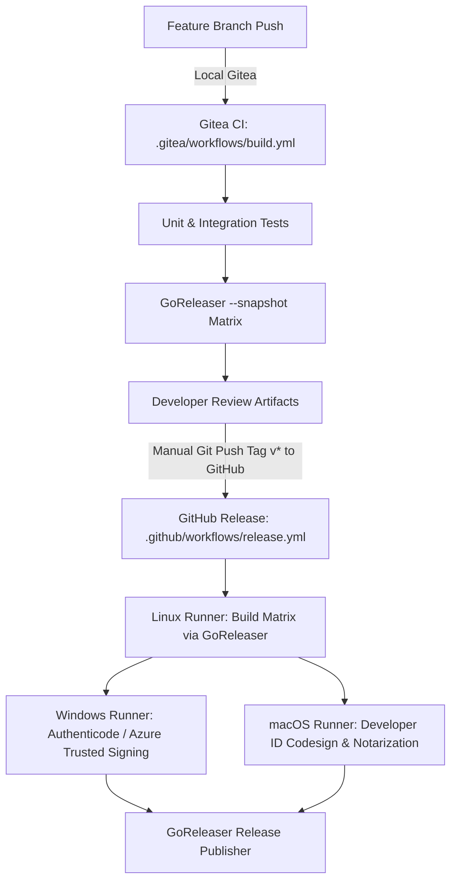

# Cross-Platform Build & Code Signing Pipeline - `acr-core`

This document details the cross-compilation matrix, snapshot validation workflow, and production signing pipelines for `acr-daemon`.

---

## 1. Cross-Compilation Architecture (GoReleaser)

- **Language & Runtime**: Go 1.25+ (`CGO_ENABLED=0` pure Go).
- **Zero CGO Dependencies**: `acr-core` contains zero `import "C"` calls or native C dependencies, enabling instantaneous single-host cross-compilation on Linux runners.
- **Build Matrix**:
  - `linux/amd64` (`acr-daemon-linux-amd64`)
  - `linux/arm64` (`acr-daemon-linux-arm64`)
  - `darwin/amd64` (`acr-daemon-darwin-amd64`)
  - `darwin/arm64` (`acr-daemon-darwin-arm64`)
  - `windows/amd64` (`acr-daemon-windows-amd64.exe`)
  - `windows/arm64` (`acr-daemon-windows-arm64.exe`)

---

## 2. Workflows & Execution Lifecycle



1. **Local Gitea CI ([`.gitea/workflows/build.yml`](.gitea/workflows/build.yml))**:
   - Triggers on every push to feature branches on our local Gitea instance (`http://localhost:3300`).
   - Executes unit tests in pure Go mode.
   - Runs `goreleaser build --snapshot --clean` to validate the full 6-target matrix.
2. **GitHub Release CI ([`.github/workflows/release.yml`](.github/workflows/release.yml))**:
   - Triggers only when a version tag (`v*`) is manually pushed to GitHub.
   - Cross-compiles unsigned binaries on `ubuntu-latest`.
   - Dispatches Windows binaries to `windows-latest` for signing.
   - Dispatches macOS binaries to `macos-latest` for Apple Developer ID codesign and `notarytool` submission.
   - Publishes signed GitHub release assets and SHA-256 checksums.

---

## 3. Windows Code Signing Setup (Post-2023 CA/Browser Standards)

Since June 2023, public CAs no longer issue exportable `.pfx` software certificates for code signing; private keys must reside in FIPS 140-2 Level 2+ hardware HSMs. The pipeline supports two workflows:

### Option A: Azure Trusted Signing (Recommended for Production)
1. Enroll in **Microsoft Azure Trusted Signing** ($9.99/mo).
2. Configure Azure AD App Registration (Service Principal).
3. Set GitHub Secrets:
   - `AZURE_TENANT_ID`: Azure Directory (tenant) ID.
   - `AZURE_CLIENT_ID`: Azure Application (client) ID.
   - `AZURE_CLIENT_SECRET`: Client Secret.
   - `AZURE_TRUSTED_SIGNING_ACCOUNT`: Account name in Azure Portal.
   - `AZURE_CERT_PROFILE_NAME`: Certificate profile name.

### Option B: Self-Signed Certificate (Zero-Cost Dev & Testing)
Generate a local self-signed code signing certificate in PowerShell:
```powershell
$cert = New-SelfSignedCertificate -Type CodeSigning -Subject "CN=ACR Daemon Dev" -CertStoreLocation Cert:\CurrentUser\My
Export-PfxCertificate -Cert $cert -FilePath cert.pfx -Password (ConvertTo-SecureString -String "yourpassword" -Force -AsPlainText)
[Convert]::ToBase64String([IO.File]::ReadAllBytes("cert.pfx"))
```
Set GitHub Secrets:
- `WINDOWS_CERT_BASE64`: Output base64 string from PowerShell command above.
- `WINDOWS_CERT_PASSWORD`: `"yourpassword"`.

---

## 4. macOS Notarization Setup

Set GitHub Secrets for Apple Developer ID signing and notarization:
- `APPLE_CERT_BASE64`: Base64-encoded `Developer ID Application` certificate (`.p12`).
- `APPLE_CERT_PASSWORD`: Password for `.p12`.
- `APPLE_KEYCHAIN_PASSWORD`: Ephemeral keychain password (any random string).
- `APPLE_ID`: Apple ID email.
- `APPLE_ID_PASSWORD`: App-specific password generated from [appleid.apple.com](https://appleid.apple.com).
- `APPLE_TEAM_ID`: 10-character Apple Developer Team ID.
